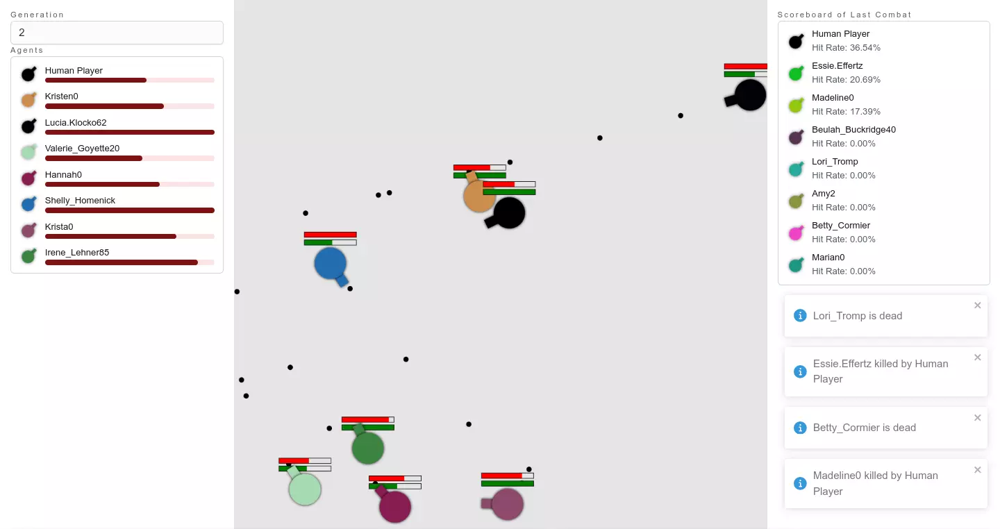

# Aim and Shoot



## Features

Compare to original project [victorqribeiro/aimAndShoot](https://github.com/victorqribeiro/aimAndShoot) here is some different(game perspective):

### Changed

- Battle area change from `1366*768` to `1024*1024`.
- Change sound effect of gun fire.
- Change original intro page to control guide.

### Added

- Add dead notification.
- Add simple scoreboard.
- Add simple player list.

### Fixed

- Fix shooting frozen when cooldown is exhausted.
- Fix sound effect play glitch.

### Removed

- Touch device support is removed.

## Background

I want to implement ECS (Entity Component System) to my side project, but I can't suddenly thinking in the "ECS way", I need some practice first, so I picked up the [project](https://github.com/victorqribeiro/aimAndShoot).

First I refactoring the project in Typescript, then move implementation to ECS, and I wrappered the game to React app. Here is some tech stack is used on the project:
- React
  - Frontend framework.
- PNPM, Vite
  - Package manager, build/bundle tool
- [Web component](https://developer.mozilla.org/en-US/docs/Web/API/Web_components)
- ECS (Entity Component System)
  - The majar topic I want to learning on this project.
  - I choose [miniplex](https://github.com/hmans/miniplex) as the ECS framework I going to used.
- Joy UI
  - A fancy React lib, provide component with simple style, almost all components have 1-1 relationship with Material UI.

## Development

```shell
pnpm install
pnpm dev
```

## Credits

- [Air-rifle-gun-shot.mp3](./src/game/aim-and-shoot/assets//gun-sfx/Air-rifle-gun-shot.mp3)
  - The work is licensed under a [Creative Commons Attribution-NonCommercial 4.0 International License](http://creativecommons.org/licenses/by-nc/4.0/).
  - Author: [Alexander](https://orangefreesounds.com/air-gun-pistol-sound-effect/)
- [Name dataset](./src/game/aim-and-shoot/utilities/name-faker/)
  - Extract from [@faker-js/faker](https://github.com/faker-js/faker) proejct.